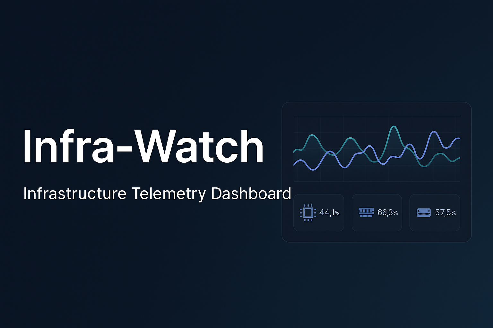

<!-- Banner -->
<p align="center">
  
</p>

# **Infra-Watch**
*A Full-Stack Infrastructure Telemetry & Lifecycle Monitoring Platform*

<p align="center">
  <a href="https://infra-watch.vercel.app"></a>
  <a href="https://infra-watch.onrender.com"></a>
  <a href="https://neon.tech"></a>
</p>

<p align="center">
  
  
</p>

---

### 📘 Overview
**Infra-Watch** is a backend-driven observability and infrastructure telemetry platform that simulates an internal DevOps monitoring system.  
It tracks host performance, detects configuration drift, and visualizes system health through a responsive React dashboard.

Built with **FastAPI**, **React (TypeScript)**, and **PostgreSQL (Neon)**, Infra-Watch demonstrates scalable backend design, real-time telemetry visualization, and **production-grade CI/CD deployment** via **Render** and **Vercel**.

---

<details>
<summary><h2>🔧 Core Features</h2></summary>

| Category | Description |
|-----------|--------------|
| **Telemetry Collection** | Collects CPU, memory, disk, and uptime metrics for multiple hosts in real time. |
| **RESTful API Layer** | Built with FastAPI and SQLAlchemy to handle metric ingestion and querying. |
| **Interactive Dashboard** | Uses Recharts to visualize host performance and system trends. |
| **Automated Alerts** | Generates severity-based alerts (info, warning, critical) from dynamic rules. |
| **Snapshot Tracking** | Captures configuration snapshots and identifies drift across environments. |
| **Authentication & RBAC** | Implements JWT-based authentication and role-based access control. |
| **Cloud Deployment** | Deployed via Render (API), Neon (database), and Vercel (frontend). |
| **Containerized Development** | Fully Dockerized for local reproducibility and CI/CD automation. |

</details>

---

<details>
<summary><h2>🧱 Tech Stack</h2></summary>

### **Backend**
- **Python**, **FastAPI**, **SQLAlchemy**, **Alembic**, **Pydantic**
- **PostgreSQL (Neon)** – scalable, cloud-native database
- **Async I/O** for concurrent API handling
- **RESTful architecture** with Pydantic schema validation

### **Frontend**
- **React (TypeScript)** + **Vite**
- **TailwindCSS** for modern, responsive design
- **Recharts** for real-time metric visualization

### **DevOps / Infrastructure**
- **Render** → backend hosting
- **Vercel** → frontend hosting
- **Docker / Docker Compose** → environment consistency
- **GitHub Actions** → automated build and deploy pipelines
- **Neon** → PostgreSQL-as-a-service

</details>

---

<details>
<summary><h2>📁 Project Structure</h2></summary>

```bash
infra-watch/
├── backend/           # FastAPI application (routes, services, models)
├── frontend/          # React (TypeScript) dashboard
├── agent/             # Python telemetry agent (optional)
├── docs/              # Technical documentation and specifications
├── docker-compose.yml # Multi-service orchestration
└── .github/           # CI/CD workflows and build pipelines
````

</details>

---

<details>
<summary><h2>🧭 Architecture Overview</h2></summary>

```text
                ┌──────────────────────────┐
                │        Frontend           │
                │ React + TypeScript + Vite │
                │ (Vercel)                  │
                └────────────┬──────────────┘
                             │ REST / JSON
                             ▼
                ┌──────────────────────────┐
                │        Backend            │
                │ FastAPI + SQLAlchemy      │
                │ (Render)                  │
                └────────────┬──────────────┘
                             │ SQL / Async I/O
                             ▼
                ┌──────────────────────────┐
                │        Database           │
                │ PostgreSQL (Neon)         │
                └──────────────────────────┘
```

</details>

---

<details>
<summary><h2>📚 Documentation</h2></summary>

| Type                    | Description                          | Link                                                         |
| ----------------------- | ------------------------------------ | ------------------------------------------------------------ |
| **System Architecture** | Design and service topology          | [`docs/system-architecture.md`](docs/system-architecture.md) |
| **API Specification**   | REST endpoints and models            | [`docs/api-spec.md`](docs/api-spec.md)                       |
| **Database Schema**     | Entity relationships and migrations  | [`docs/db-schema.md`](docs/db-schema.md)                     |
| **Deployment Guide**    | Render, Neon, and Vercel integration | [`docs/deployment.md`](docs/deployment.md)                   |
| **Roadmap**             | Future enhancements                  | [`docs/planning/roadmap.md`](docs/planning/roadmap.md)       |

</details>

---

<details>
<summary><h2>🧑‍💻 Author & License</h2></summary>

**MIT License © 2025 Justin Bras**

* [LinkedIn](https://linkedin.com/in/justin-bras)
* [Portfolio](https://justinbras.vercel.app)
* [GitHub](https://github.com/BrasJ)

</details>

---

<details>
<summary><h2>💡 Recruiter Highlights</h2></summary>

This project demonstrates:

* **Backend system design** using FastAPI, SQLAlchemy, and async I/O
* **Full-stack integration** and telemetry visualization with React + REST APIs
* **Infrastructure observability** and real-time data monitoring
* **Cloud deployment** with Render, Neon, and Vercel
* **CI/CD automation** and containerization
* Production-style software engineering for **DevOps and platform teams**

</details>

---

### 🔗 **Live Demo**

* **Frontend:** [infra-watch.vercel.app](https://infra-watch.vercel.app)
* **Backend API:** [infra-watch.onrender.com](https://infra-watch.onrender.com)


